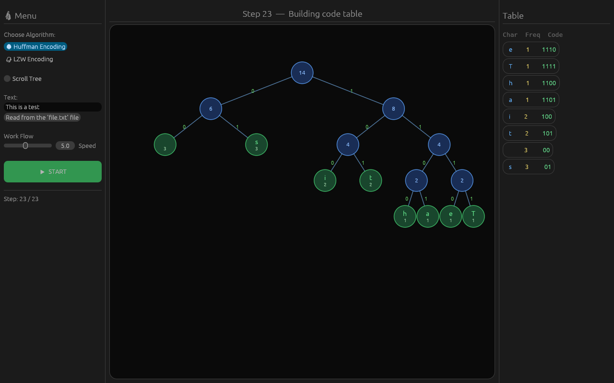
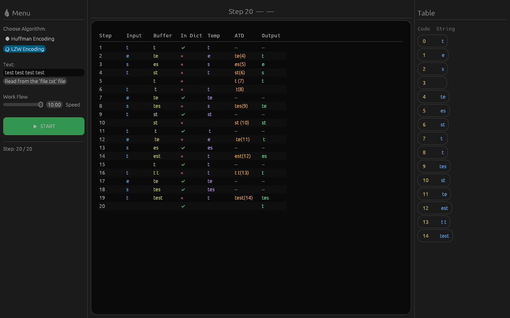

# encoding-huf-lzw
Simply visualizing Huffman and LZW algorithms with input.





## What it does

Visualizes two lossless compression algorithms step by step:

- **Huffman Encoding** — builds a frequency table, constructs the tree merge by merge, then derives the code table
- **LZW Encoding** — shows each encoding step with buffer, dictionary state, and output

You can type input directly or read the first line from a `file.txt` in the project root.

## Requirements

- [Rust](https://www.rust-lang.org/tools/install)

## Run

```bash
git clone https://github.com/Esat-cpu/encoding-huf-lzw
cd encoding-huf-lzw
cargo run --release
```
